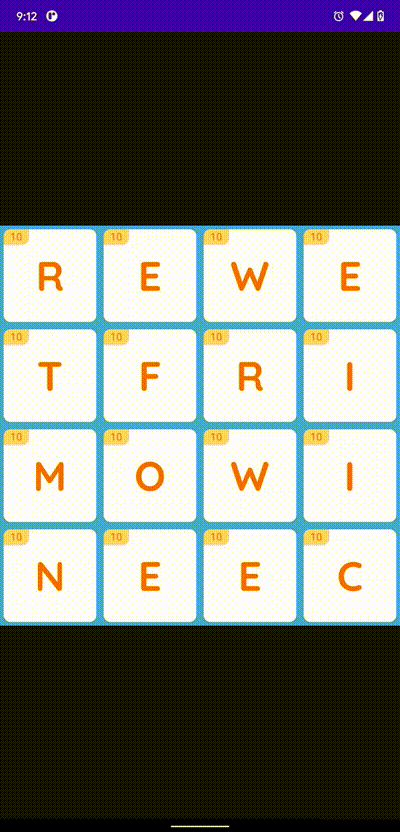

## WordBoxGrid

What are we trying to achieve: The game view of word game similar to wordament or word games around it.

I believe the famous Microsoft Wordament game is developed using Unity for Android.

But trying to achieve the same using basic android priciples is easily achievable:

- One approach can be adding individual wordButton (the base view class consisting of score and alphabet) n*n  times and tracking their IDs along with their position(row, col) while implementing touch listener.

- Other approach could be using the wordButton, in a recycler view and handling the **adapterPositions**.

We need to decide how do we change the UI part of button on the states: 
- selected : when the button is dragged
- correct : when the sequence formed using the words dragged resemebles a correct word in the game
- incorrect: when the sequence does not a form a correct word

This can be done either creating custom states(in attrs.xml) or changing the resource properties of the view.

We will implement the recycler View approach, and adding properties(selected, correct, inCorrect) itself to the `wordButton`.

Files to look out for are `WordBoxGridTouchListener`

Basic implementation of the onTouchEvent on a Recycler View using the `RecyclerView.OnItemTouchListener`

A modified version of this can be seen in Google Photos, which is further explained well in [this](https://github.com/afollestad/drag-select-recyclerview) helpfull library.
